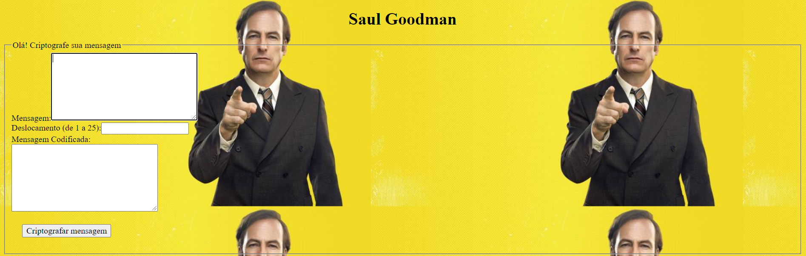
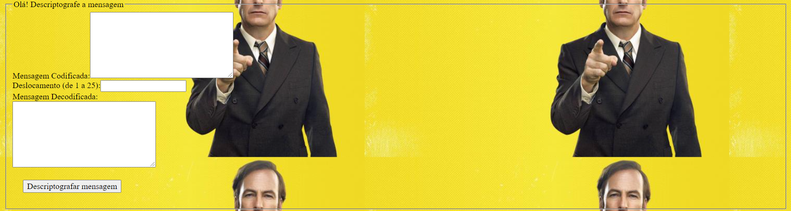

# Cifra de César

## Índice

* [1. Projeto
* [2. Usuários
* [3. Como usar
* [4. Desenvolvimento

***

## 1. Projeto

O projeto foi feito pensando em Saul Goodman. Saul é um personagem ficticio de uma série (Better Call Saul). Na série, Saul é um advogado que defende criminosos, como membros de gang's e do cartel. Para se comunicar com seus clientes, já que a polícia constantemente o persegue, criei um site para que ele possa interagir com eles sem correr nenhum risco de ser descoberto.

-[Link](https://karinafs.github.io/SAP005-cipher/.) do site

## 2. Usuários

Saul e seus clientes

## 3.  Como utilizar

* No campo "Mensagem" Saul deve escrever a mensagem que deseja criptografa
* No campo "Deslocamento" deve escolher o número do deslocamento
* No campo "Mensagem Codificada" irá aparecer a mensagem 
* O cliente irá receber a mensagem codificada e deve descodificar na segunda área
* Botão para codificar e descodificar a mensagem

## 4. Desenvolvimento do projeto

* Ententer a Cifra de César
* Escolha dos usuários
* Estirizar a página
* Entender a lógica
* HTML
* Tentar fazer o código funcionar
* Read Me
